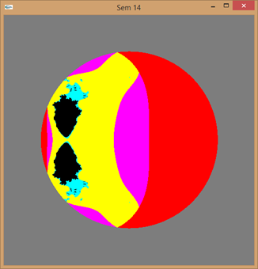

# OpenGL Fractal Visualization

## Overview
This project generates and displays a fractal image using OpenGL. The fractal is based on the Mandelbrot set, and it is rendered as a colorful image with varying colors based on the iteration count.

## Features
- **Fractal Generation:** Computes the Mandelbrot set and colors each pixel based on the number of iterations.
- **Dynamic Rendering:** Uses OpenGL to display the generated fractal image.
- **Color Mapping:** Applies a gradient color scheme to visualize the fractal.

## Usage
- **Display Fractal:** The program will automatically render the fractal image when run.
- **Exit:** Close the window.

## Results
Below are examples of the fractal image generated with different constant values:

|  |  |
|---------------------|---------------------|
|  |  |

Each image demonstrates how different constant values affect the fractal's appearance.

## Code Structure
- **main()**: Initializes OpenGL, sets up the display, and starts the main loop.
- **Init()**: Configures OpenGL settings, generates the fractal image, and stores it in an array.
- **Reshape()**: Adjusts the viewport and projection matrix when the window is resized.
- **Draw()**: Renders the fractal image to the screen.

## Dependencies
- **OpenGL**: 3D rendering library
- **GLUT**: Utility toolkit for OpenGL
- **GLAUX**: Additional utilities for OpenGL
